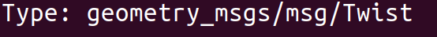
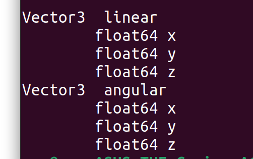

# 这个是github同款开源小项目解读

## 1.检测ros2环境是否生效
```bash
ros2 topic list
```
如果能正常输出无error(即使为空列表)，说明你的ROS2环境已经正常生效。


## 2.检查你的ros2小海龟是否正常
```bash
ros2 pkg list | grep turtlesim
```
### 如果以正常输出turtlesim，没有的话需要按照下面方式安装：
```bash
sudo apt install ros-humble-turtlesim -y
# jazzy用户把humble换成jazzy
```


### 先手动跑一下海龟，确认环境没问题
```bash
ros2 run turtlesim turtlesim_node
```
会弹出一个蓝底窗口，中间有只海龟。


### 现在顺便看一眼海龟有哪些话题（这一步很重要！！！）保持之前窗口运行，新开一个窗口 
```bash
ros2 topic list
```
看看有没有/turtle1/cmd_vel 和 /turtle1/pose 


#### 1.我们先看cmd_vel(发给海龟的速度指令： 
看它的数据格式： 
```bash
ros2 topic info /turtle1/cmd_vel -v
```

滑到第一行Type会显示：Type: geometry_msgs/msg/Twist （Twist是我们写代码要import的类型


##### 让我们看看它字段长什么样： 
```bash
ros2 interface show geometry_msgs/msg/Twist
```

Vector3  linear float64 x float64 y float64 z （xyz方向线速度
Vector3  angular float64 x float64 y float64 z （xyz方向加速度


想强调就 **加粗**，想写代码就 `这样`。

## 小标题二

- 列表项
- 列表项

```js
console.log("这段代码会带高亮、行号和复制按钮");
```

> [!NOTE]
> 这是个提示框，也支持 [!TIP] [!WARNING] [!IMPORTANT]

## 小标题三

结尾。
